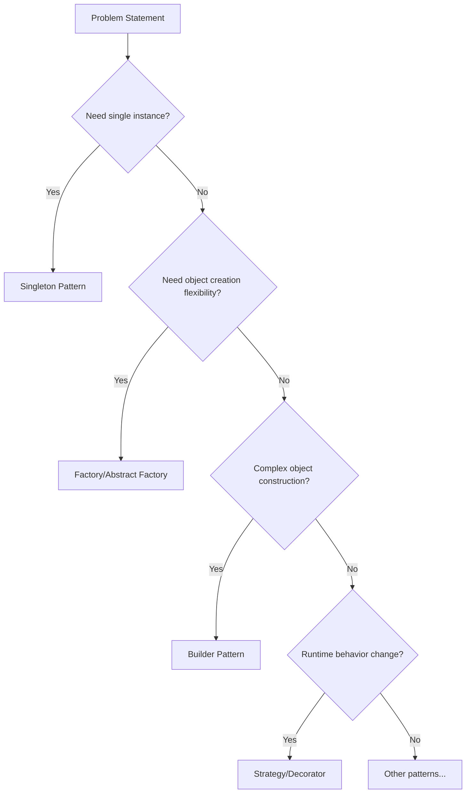

# Senior SDET Interview Preparation Guide
## Design Patterns in Test Automation

---

## 🎯 **Workspace Overview**

This comprehensive workspace demonstrates **advanced design pattern implementations** specifically tailored for **Test Automation** using modern technologies and best practices. Created for **Senior SDET interview preparation** and **real-world framework development**.

### **Current Status: ✅ PHASE 1 COMPLETED**
- ✅ **Singleton Pattern Project** - Fully implemented with SpiceJet automation
- ✅ **Multi-module Maven workspace** - Centralized dependency management
- ✅ **CI/CD Pipeline** - GitHub Actions with comprehensive reporting
- ✅ **Docker Integration** - Selenium Grid containerization
- ✅ **Comprehensive Documentation** - Pattern explanations and execution guides

---

## 📋 **What's Already Implemented**

### **1. Singleton Pattern Project** 
**Location**: `singleton-pattern-project/`

**Key Features**:
- ✅ **Thread-Safe WebDriver Management** with double-checked locking
- ✅ **Anti-Pattern Protections** (Cloning, Serialization, Reflection attacks)
- ✅ **ThreadLocal Support** for parallel test execution
- ✅ **Configuration-Driven** browser selection and settings
- ✅ **SpiceJet Test Automation** with real flight search scenarios
- ✅ **Page Object Model** integration with Singleton WebDriver
- ✅ **Comprehensive Logging** with Log4j2
- ✅ **Allure Reporting** integration

**Test Site**: SpiceJet.com
- Flight search functionality
- Booking calendar validation
- One-way and round-trip search scenarios

**Interview Ready Topics**:
- Why Singleton for WebDriver management?
- Thread-safety in parallel execution
- Memory optimization techniques
- Anti-pattern protection strategies

### **2. Workspace Infrastructure**

**Multi-Module Maven Setup**:
```xml
<!-- Parent POM with centralized dependency management -->
<modules>
    <module>singleton-pattern-project</module>
    <module>factory-pattern-project</module>     <!-- Next -->
    <module>builder-pattern-project</module>     <!-- Next -->
    <!-- ... and 8 more pattern projects -->
</modules>
```

**CI/CD Pipeline**:
- ✅ **GitHub Actions** workflow
- ✅ **Multi-browser testing** (Chrome, Firefox, Edge)
- ✅ **Parallel execution** strategies
- ✅ **Allure report generation** and publishing
- ✅ **Docker integration** for Selenium Grid
- ✅ **Security scanning** with Trivy
- ✅ **Performance testing** hooks

**Docker Configuration**:
- ✅ **Selenium Grid** with Hub and multiple nodes
- ✅ **Allure reporting service** 
- ✅ **Scalable browser instances**

---

## 🚧 **Next Implementation Phase (Remaining Projects)**

### **2. Factory Pattern Project**
**Target**: OrangeHRM Login Automation
```java
// WebDriver Factory for multiple browsers and environments
public class WebDriverFactory {
    public static WebDriver createDriver(BrowserType type, boolean remote) {
        return switch(type) {
            case CHROME -> createChromeDriver(remote);
            case FIREFOX -> createFirefoxDriver(remote);
            case EDGE -> createEdgeDriver(remote);
        };
    }
}
```

**Interview Focus**: 
- When to use Factory vs Singleton?
- Abstract Factory for complex object creation
- Dependency Injection integration

### **3. Builder Pattern Project**
**Target**: Automation Exercise User Registration
```java
// Fluent test data builder
public class UserDataBuilder {
    public static UserDataBuilder user() {
        return new UserDataBuilder();
    }
    
    public UserDataBuilder withName(String name) { /* ... */ }
    public UserDataBuilder withEmail(String email) { /* ... */ }
    public User build() { /* ... */ }
}
```

**Interview Focus**:
- Complex object construction
- Fluent API design
- Test data management strategies

### **4. Strategy Pattern Project** 
**Target**: Multiple Search Strategies
```java
// Different ways to perform search
public interface SearchStrategy {
    void executeSearch(String query);
}

public class TypeAndEnterStrategy implements SearchStrategy { /* ... */ }
public class ClickButtonStrategy implements SearchStrategy { /* ... */ }
public class JavaScriptStrategy implements SearchStrategy { /* ... */ }
```

**Interview Focus**:
- Runtime algorithm selection
- Eliminating conditional complexity
- Extensibility and maintainability

### **5. Decorator Pattern Project**
**Target**: Enhanced WebDriver Capabilities
```java
// Extending WebDriver without modification
public class LoggingWebDriver implements WebDriver {
    private WebDriver driver;
    
    @Override
    public void get(String url) {
        log.info("Navigating to: {}", url);
        driver.get(url);
        log.info("Navigation completed");
    }
}
```

**Interview Focus**:
- Open/Closed Principle adherence
- Runtime behavior modification
- Aspect-Oriented Programming concepts

### **6-11. Advanced Patterns** (Observer, Command, Chain of Responsibility, Adapter, Template Method, Page Object Model)

---

## 💡 **Senior SDET Interview Mastery**

### **Pattern Selection Decision Tree**

**When interviewer asks: "Which pattern would you use for...?"**



### **Implementation Thought Process Framework**

For any pattern implementation, demonstrate this thinking:

1. **Problem Identification**
   - "The current approach has these limitations..."
   - "We need to solve X without breaking Y..."

2. **Pattern Selection Reasoning**
   - "I chose Pattern X because..."
   - "Alternative patterns like Y were considered but..."

3. **Implementation Strategy**
   - "First, I'll define the interfaces..."
   - "Then, implement concrete classes..."
   - "Finally, integrate with existing framework..."

4. **Testing & Validation**
   - "Unit tests for pattern behavior..."
   - "Integration tests with WebDriver..."
   - "Performance and memory impact analysis..."

5. **Maintenance & Evolution**
   - "Future extensibility considerations..."
   - "Potential refactoring needs..."

### **Advanced Topics You'll Master**

**Thread Safety & Concurrency**:
```java
// Thread-safe singleton with performance optimization
public class WebDriverSingleton {
    private static volatile WebDriverSingleton instance;
    private final ThreadLocal<WebDriver> driverPool = new ThreadLocal<>();
    
    // Double-checked locking implementation
    public static WebDriverSingleton getInstance() {
        if (instance == null) {
            synchronized (WebDriverSingleton.class) {
                if (instance == null) {
                    instance = new WebDriverSingleton();
                }
            }
        }
        return instance;
    }
}
```

**Microservices Testing Architecture**:
```java
// Service-oriented test design
public class TestOrchestrator {
    private final ApiTestService apiService;
    private final DatabaseTestService dbService;
    private final UITestService uiService;
    
    public void executeE2ETest() {
        apiService.setupTestData()
                  .validateContracts();
        
        dbService.verifyDataState();
        
        uiService.validateUserJourney();
    }
}
```

**Performance Testing Integration**:
```java
// Load testing with UI validation
@Test
public void performanceWithUIValidation() {
    LoadTestResult result = JMeterIntegration
        .executeLoadTest("flight-search-scenario.jmx");
    
    // Validate UI responsiveness under load
    assertThat(result.getResponseTime()).isLessThan(Duration.ofSeconds(5));
    
    // UI validation after load test
    validateUIFunctionality();
}
```

---

## 🎯 **Execution Commands**

**Quick Start**:
```bash
# Compile all projects
mvn clean compile

# Run singleton pattern tests
cd singleton-pattern-project && mvn test

# Run with specific browser
mvn test -Dbrowser=firefox -Dheadless=true

# Generate reports
mvn allure:serve

# Docker execution
docker-compose up -d
mvn test -Dremote.execution=true -Dgrid.url=http://localhost:4444
```

**Advanced Execution**:
```bash
# Parallel execution with custom thread count
mvn test -DthreadCount=5 -Dparallel=methods

# Cloud execution (LambdaTest)
mvn test -P remote -Dlt.username=your_user -Dlt.accesskey=your_key

# Performance test execution
mvn test -Dtest=**/*PerformanceTest

# CI pipeline simulation
mvn clean test -P ci -Dheadless=true -Dbrowser=chrome
```

---

## 📈 **Learning Path for Complete Mastery**

### **Phase 1: Foundation (✅ COMPLETED)**
- ✅ Singleton Pattern implementation
- ✅ Thread-safe WebDriver management  
- ✅ Basic CI/CD pipeline setup
- ✅ Docker integration basics

### **Phase 2: Core Patterns (🚧 NEXT)**
- 🔄 Factory Pattern for multi-browser support
- 🔄 Builder Pattern for test data management
- 🔄 Strategy Pattern for multiple approaches
- 🔄 Decorator Pattern for enhanced capabilities

### **Phase 3: Advanced Patterns**
- 🔄 Observer Pattern for real-time reporting
- 🔄 Command Pattern for test action management
- 🔄 Chain of Responsibility for validation chains
- 🔄 Adapter Pattern for third-party integrations

### **Phase 4: Framework Architecture**
- 🔄 Template Method for test execution flow
- 🔄 Complete Page Object Model implementation
- 🔄 Advanced reporting and analytics
- 🔄 Performance testing integration

### **Phase 5: Production Ready**
- 🔄 Security testing integration
- 🔄 API + UI test correlation
- 🔄 Advanced CI/CD with multi-environment support
- 🔄 Monitoring and alerting systems

---

## 🏆 **Interview Success Metrics**

After completing this workspace, you'll confidently answer:

**Architecture Questions**:
- "Design a test automation framework from scratch"
- "How do you handle flaky tests in CI/CD?"
- "Implement parallel execution with proper resource management"

**Pattern-Specific Questions**:
- "When would you choose Singleton over Factory for WebDriver?"
- "How do you implement thread-safe design patterns?"
- "What are the trade-offs between different creational patterns?"

**Advanced Implementation**:
- "Show me how you'd implement retry mechanisms"
- "Design a strategy for handling dynamic test data"
- "How would you integrate API and UI testing?"

**Operational Excellence**:
- "How do you monitor test execution in production?"
- "Design a reporting strategy for stakeholders"
- "Implement security scanning in your test pipeline"

---

## 📝 **Next Steps**

1. **Complete Pattern Implementation**: Implement remaining 10 design patterns
2. **Advanced Features**: Add performance testing, security scanning, API integration
3. **Production Deployment**: Set up complete CI/CD with multiple environments
4. **Documentation**: Create detailed pattern explanation videos/presentations
5. **Interview Preparation**: Practice explaining each pattern's problem/solution/implementation

**Time Estimate**: 2-3 weeks for complete implementation
**Interview Readiness**: Senior SDET level after full completion

---

*This workspace serves as your comprehensive preparation platform for Senior SDET interviews, demonstrating both theoretical knowledge and practical implementation skills with real-world test automation scenarios.*
